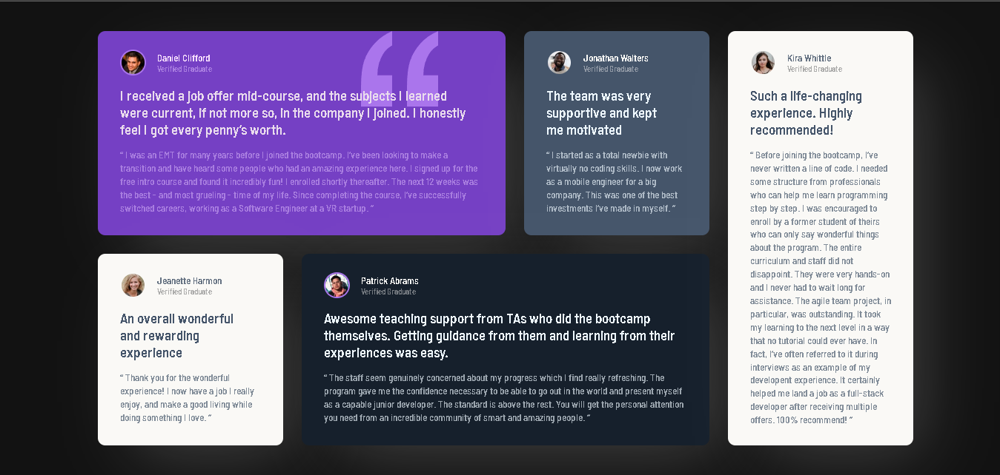
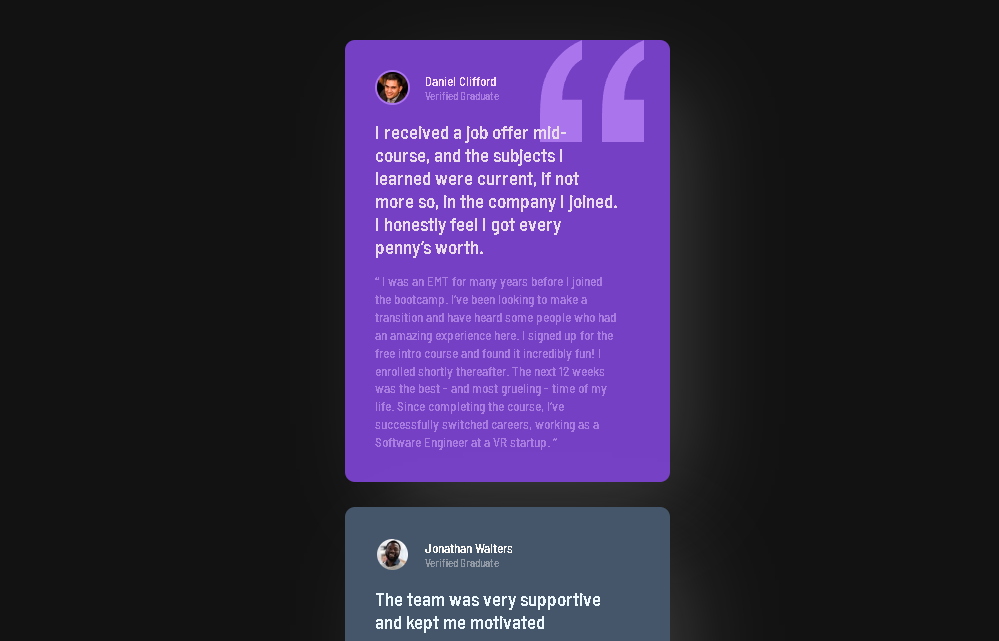

# Frontend Mentor - Testimonials grid section solution

This is a solution to the [Testimonials grid section challenge on Frontend Mentor](https://www.frontendmentor.io/challenges/testimonials-grid-section-Nnw6J7Un7). Frontend Mentor challenges help you improve your coding skills by building realistic projects. 

## Table of contents

- [Overview](#overview)
  - [The challenge](#the-challenge)
  - [Screenshot](#screenshot)
  - [Links](#links)
- [My process](#my-process)
  - [Built with](#built-with)
  - [What I learned](#what-i-learned)
  - [Continued development](#continued-development)
  - [Useful resources](#useful-resources)
- [Acknowledgments](#acknowledgments)

**Note: Delete this note and update the table of contents based on what sections you keep.**

## Overview

### The challenge

Users should be able to:

- View the optimal layout for the site depending on their device's screen size

### Screenshot

### Links

- Solution URL: [Solution URL](https://github.com/SeaNot-Not/testimonials-frontend-mentor-challenge)
- Live Site URL: [Live Site URL](https://seanot-not.github.io/testimonials-frontend-mentor-challenge/)

## My process

### Built with

- HTML
- CSS
- Flexbox
- CSS Grid
- Mobile-first workflow

**Note: These are just examples. Delete this note and replace the list above with your own choices**

### What I learned

In this challenge, I have learned a basic understanding of flexbox and grid in design layout.

### Continued development

I am looking forward to applying my learnings from this challenge to future projects and improving my current skill in design layout.

### Useful resources

- [Resource 1](https://yoksel.github.io/flex-cheatsheet/) - Helped me in using flexbox.
- [Resource 2](https://grid.malven.co/) - Helped me in using grid.

## Acknowledgments

I would like to express my deepest gratitude to the following:
- [Frontend Web Development Bootcamp Course (JavaScript, HTML, CSS)](https://www.youtube.com/watch?v=zJSY8tbf_ys&t=69668s): For providing a comprehensive introduction to front-end development, which laid the foundation for my learning journey.
- Frontend Mentor: For offering a valuable platform and the opportunity to work on free challenges, helping me to practice and refine my skills.
- My friends, family, and especially my mom: For their unwavering support and encouragement, which inspires me every day to continue learning and growing in my field.
